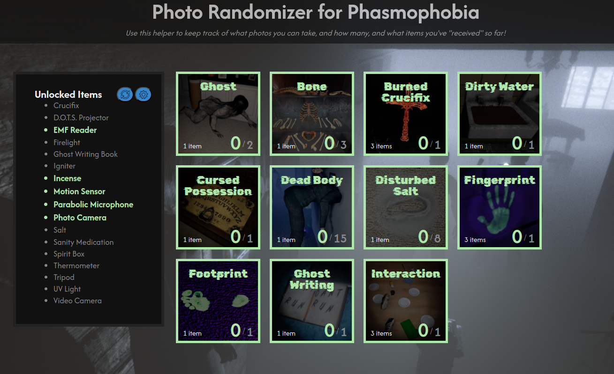

# Phasmophobia_Photo_Randomizer
A software helper for keeping track of a photo randomizer in the game Phasmophobia.

## How to Use
The photo randomizer is hosted at this link: [https://fuzzygameson.github.io/Phasmophobia_Photo_Randomizer/](https://fuzzygameson.github.io/Phasmophobia_Photo_Randomizer/)

## Reporting Bugs or Suggesting Features
To report a bug or suggest a new feature, use the [Issues tab above](https://github.com/FuzzyGamesOn/Phasmophobia_Photo_Randomizer/issues)!

## I love this! How can I support its development?
Thank you! Every little bit of support helps me to continue to develop free-to-use projects like this, so [it'd be awesome if you bought me a coffee to say thanks](https://www.buymeacoffee.com/fuzzygames)!
